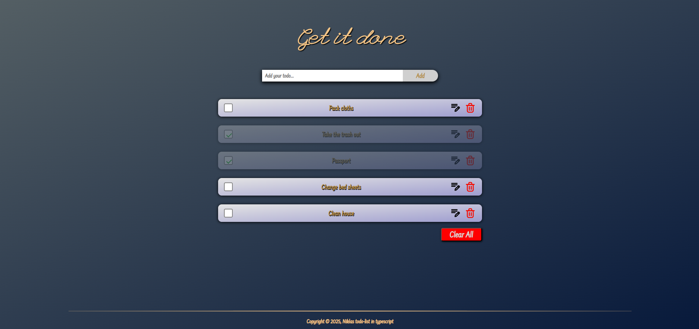

Detta är en todo-list inom typescript. Är nöjd med mitt arbete, men hade önskat att jag skulle hinna med VG delen också. Får göra den i efterhand.

I koden har jag använt filter() funktion för att hitta ett visst värde med ett specifikt id. Egentligen hade jag i första hand valt find() funktionen, men det blev bara en massa felmeddelanden i konsolen. Därav att jag gjorde om det till en filter() funktion istället. Problemet är nu löst, men istället för att skriva om, så kände jag att det var bättre att låta koden vara, då den fungerar som den ska.

